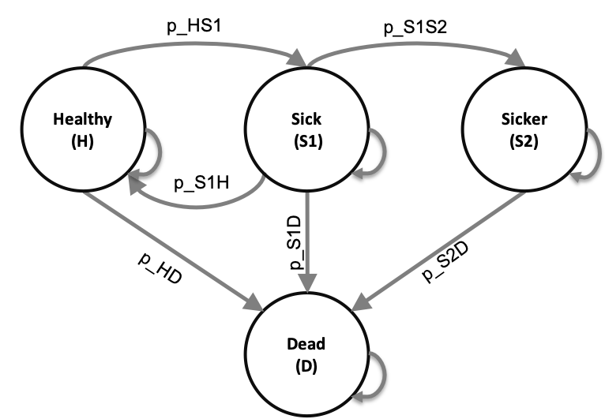

```{r, echo = FALSE}
## Journal Abbreviations
# library(RJSONIO)
# if(!file.exists("abbreviations.json")){
# download.file("https://ndownloader.figshare.com/files/5212423","wos_abbrev_table.csv")
#   abbrev <- read.csv("wos_abbrev_table.csv", sep = ";", header = TRUE, stringsAsFactors = FALSE)
#   abbrev$full <- gsub("\\", "\\\\",abbrev$full, fixed = TRUE)
#   abbrev.list <- list('default' = list('container-title' = abbrev$abbrev.dots))
#   names(abbrev.list$default$`container-title`) = abbrev$full
#   write(toJSON(abbrev.list), "abbreviations.json")
#   rm(abbrev)
#   rm(abbrev.list)
# }
```

```{r setup, include=FALSE}
#install.packages(c("kableExtra", "scales", "tensorA" ))
library(knitr)
library(kableExtra) # https://haozhu233.github.io/kableExtra/awesome_table_in_html.html
library(dplyr)
library(reshape2)
library(ggplot2)
library(scales) # For dollar signs and commas
library(boot)
# devtools::install_github("DARTH-git/dampack")
library(dampack)
# devtools::install_github("DARTH-git/darthtools")
library(darthtools)
knitr::opts_chunk$set(echo = TRUE)
doc_type <- knitr::opts_knit$get('rmarkdown.pandoc.to')

# Load costumed functions
source("../R/Functions STM_01.R")
# source("../R/Functions.R")


# Define parameters
cycle_length <- 1  # cycle length equal one year
n_age_init <- 25   # age at baseline
n_age_max  <- 100  # maximum age of follow up
n_cycles <- n_age_max - n_age_init # time horizon, number of cycles

## General setup
v_names_states <- c("H", "S1", "S2", "D") # the 4 health states of the model:
                               # Healthy (H), Sick (S1), Sicker (S2), Dead (D)
n_states <- length(v_names_states) # number of health states 
d_c <- d_e <- 0.03 # equal discount of costs and QALYs by 3%
v_names_str <- c("Standard of care", # store the strategy names
                 "Strategy A", 
                 "Strategy B",
                 "Strategy AB") 
n_str <- length(v_names_str)

## Transition probabilities (per cycle)
r_HD    <- 0.002 # constant rate of dying when Healthy (all-cause mortality rate)
p_HS1   <- 0.15  # probability of becoming Sick when Healthy
p_S1H   <- 0.5   # probability of becoming Healthy when Sick
p_S1S2  <- 0.105 # probability of becoming Sicker when Sick
hr_S1   <- 3     # hazard ratio of death in Sick vs Healthy
hr_S2   <- 10    # hazard ratio of death in Sicker vs Healthy 

# Effectiveness of treatment B
hr_S1S2_trtB <- 0.6 # hazard ratio of becoming Sicker when Sick under treatment B

## Transition probability of becoming Sicker when Sick for treatment B
# transform probability to rate
r_S1S2      <- -log(1-p_S1S2)
# apply hazard ratio to rate to obtain transition rate of becoming Sicker when Sick for treatment B
r_S1S2_trtB <- r_S1S2 * hr_S1S2_trtB
# transform rate to probability
p_S1S2_trtB <- 1-exp(-r_S1S2_trtB*cycle_length) # probability to become Sicker when Sick 
                                                 # under treatment B conditional on surviving

## Cost and utility inputs 
# State rewards
c_H    <- 2000  # cost of being Healthy for one cycle 
c_S1   <- 4000  # cost of being Sick for one cycle 
c_S2   <- 15000 # cost of being Sicker for one cycle
c_D    <- 0     # cost of being dead for one cycle
c_trtA <- 12000 # cost of treatment A for one cycle 
c_trtB <- 13000 # cost of treatment B for one cycle

u_H    <- 1     # utility of being Healthy for one cycle 
u_S1   <- 0.75  # utility of being Sick for one cycle 
u_S2   <- 0.5   # utility of being Sicker for one cycle
u_D    <- 0     # utility of being dead for one cycle
u_trtA <- 0.95  # utility when being treated for one cycle

# PSA parameters
n_sim <- 1000 # Number of PSA samples
```

```{r figure-setup, echo=FALSE, include=FALSE}
## chunk will ensure that:
library(formatR)
# indent = 2: two spaces of indentation.
# tidy=TRUE puts formatR to work to produce a beautiful and standardized layout code.
if(!knitr:::is_html_output())
{
  # options("width"=56)
  knitr::opts_chunk$set(tidy.opts=list(indent = 1.5)) # width.cutoff=56, tidy = TRUE
  knitr::opts_chunk$set(fig.pos = 'H')
}

## chunk will ensure that:
# all the figures generated by the report will be placed in the figs/sub-directory
# all the figures will be 6.5 x 4 inches and centered in the text.
knitr::opts_chunk$set(fig.path="figs/", fig.width=8, fig.height=6, fig.align="center")
```

# Introduction

Healthcare policymakers are often tasked to allocate healthcare resources under constrained budgets and uncertain contexts. Their final choice can be informed by health economic evaluations, which often rely on decision models to synthesize evidence from different sources and project long-term outcomes of different alternatives. A commonly used decision model is the discrete-time cohort state-transition model (cSTM), often referred to as a Markov model.[@Kuntz2017]

In a recent review, we illustrated the increased utilization of R's statistical programming framework in health decision sciences. We provided a collection of resources for its application in medical decision making.[@Jalal2017b] Many packages have been developed specifically to estimate and construct cSTMs in R. However, these packages are necessarily inflexible and require the user to follow a specific cSTM structure. If the desired cSTM does not fit within this structure, using these packages can be challenging. For example, a realistic cSTM that accounts for simulation time-dependency (e.g., age dependency) and time dependency on state residence is challenging in the existing packages. Using an R package does not guide how to conceptualize and implement realistic cSTMs in a programming language, which is a current literature gap. This introductory tutorial is part of a two-part series that aim to (1) conceptualize time-independent cSTMs in a programming language and (2) guide how to implement these cSTMs in _base_ R. We focus on using R _base_ packages to avoid the limitation of constructing cSTMs in a pre-specified structure defined by a package and to ensure modelers understand the concept and structure of cSTMs rather than implementing them as a "black box". 

A cSTM is a state transition model with a hypothetical cohort transitioning between different health states over time. In contrast, an individual-based state transition model (iSTM) is another variety of STM, where individuals are the modeling unit. Each of them can transition between health states over time.[@Siebert2012c] We have previously published a tutorial on the implementation of iSTM in R.[@Krijkamp2018] This introductory tutorial covers time-independent cSTMs and how to use them to conduct a full cost-effectiveness analysis comparing multiple interventions and implementing probabilistic sensitivity analyses. The accompanying advanced tutorial covers cSTMs for which transition probabilities depend on simulation time and time spent in a state, calculation of various epidemiological outcomes, and incorporation of transition rewards.[@Alarid-Escudero2021b] We first describe each of the components of a time-independent cSTM. Then, we illustrate the implementation of these components with an example. Our general conceptualization should apply to other programming languages (e.g., MATLAB, Python, C++, Julia). The full R code used in this tutorial is provided in the supplementary materials so that readers can replicate and modify the example to fit their needs. The reader can find the most up-to-date model code and code to create the graphs of this tutorial in the accompanying GitHub repository (https://github.com/DARTH-git/Cohort-modeling-tutorial). We assume that the reader is familiar with the basics of decision modeling and coding in programming languages. Thus, a prior introduction to R and linear algebra for decision modelers is recommended.

# Cohort state-transition models (cSTMs)
A cSTM is most appropriate when the decision problem can be described with a reasonable number of health states. cSTMs are often used because of their transparency, efficiency, ease of debugging, and ability to conduct specific value-of-information analyses.[@Siebert2012c] cSTMs have been used to evaluate screening and surveillance programs,[@Suijkerbuijk2018; @Sathianathen2018a] diagnostic procedures,[@Lu2018b] disease management programs,[@Djatche2018], and interventions.[@Pershing2014; @Smith-Spangler2010] 

A cSTM consists of a set of $n_S$ mutually exclusive and collectively exhaustive health states. The cohort is assumed to be homogeneous within each health state. All persons residing in a particular health state are assumed to remain in the state for a cycle, have the same characteristics, and are indistinguishable from one another with respect to the cost and utility of being in the state. The cohort transitions between health states with defined probabilities, which are called "transition probabilities." A transition probability represents the chance that individuals in the cohort residing in a state in a given cycle transition to another state or remain in the same state for the next cycle. Transition probabilities only depend on the current health state in a given cycle. They do not depend on the history before that cycle, often referred to as the "Markovian assumption."[@Kuntz2001; @Sonnenberg1993; @Beck1983] This means that in a Markovian cSTM, transition probabilities do not depend on the history of past transitions or time spent in a given state.

cSTMs are classified as either time-independent (time-homogeneous) or time-dependent (time-inhomogeneous). Time-independent cSTMs have constant transition probabilities (i.e., the probability of any state transition is independent of time). In contrast, time-dependent cSTMs have transition probabilities or rewards that vary over time. Time-independent models are simpler to implement than time-dependent ones, but most problems in healthcare are best modeled with time-dependent cSTMs. For example, time-dependent cSTMs can capture the increasing age-specific background mortality as the cohort ages (age dependency) and dependency on the amount of time spent in a given state (state residence). In this tutorial, we cover time-dependent cSTMs. In an advanced tutorial, we describe how to construct time-independent cSTM.[@Alarid-Escudero2021b]

<!-- In the next sections, we will illustrate the conceptualization and implementation of a cSTM in R to conduct a cost-effectiveness analysis (CEA) using an example described in the next section. Researchers can easily then customize this application to their own needs. In the following sections, we conceptualize cSTMs and show how to implement them in programming languages using mathematical notation of the model structures and mathematical equations to describe disease progression. We explain the conceptualization of cSTM in programming languages using mathematical notations of the model structures and mathematical equations to describe the simulations. These sections are followed with chunks of R code to translate the mathematical notation to R code. -->

## Rates versus probabilities

Probabilities and rates are commonly used input parameters in decision-analytic models. While they are often numerically similar in practice, there is a subtle but important conceptual difference. A rate represents the \textit{instantaneous} force of an event occurrence per unit time, while a probability represents the cumulative risk of an event over a defined time period. 

To discuss these concepts further, let's assume that after 10,000 person-years of observation of healthy individuals (e.g., 10,000 observed for an average of 1 year, 5,000 individuals observed for an average of 2 years, etc.), we observe 500 events of getting sick. The annual event rate of becoming sick, $\mu_{yearly}$, is then equal to $\mu_{yearly}=500 / 10,000=0.05$.

If we then wanted to know what proportion of an initially healthy cohort becomes sick at the end of the year, then we can convert the annual rate of becoming sick into an annual probability of becoming sick using the following relationship:
\begin{equation}
    p_{yearly} = 1-\exp{\left(-\mu_{yearly} \right)}.
    (\#eq:rate-to-prob-ann)
\end{equation}

This equation assumes that the rate of becoming sick is constant over the year, which implies that the time until a healthy person becomes sick is exponentially distributed. The parameter $p_{yearly}$ is the transition probability from healthy to sick in a cSTM when using an annual cycle length.

If we were concerned that an annual cycle length was too long to capture disease dynamics accurately, we could instead convert to a monthly probability of becoming sick (a monthly transition probability). To do this, we first calculate the monthly rate of becoming sick. Because rates are instantaneous, the monthly rate is just the annual rate divided by 12:
\begin{equation}
    \mu_{monthly} = \mu{yearly} / 12.
    (\#eq:rate-ann-to-month)
\end{equation}

The monthly probability can then be calculated from the monthly rate using equation \@ref(eq: rate-to-prob-ann): 
\begin{equation}
    p_{monthly} = 1-\exp{\left(-\mu_{monthly}\right)}.
\end{equation}

Sometimes, a transition probability might be available from published literature in one time frame (e.g., annual), whereas the model cycle length is different (e.g., monthly). In this case, one can first convert the transition probability to a rate using the following formula:
\begin{equation}
    \mu_{yearly} = -\ln{\left(1-p_{yearly}\right)}.
    (\#eq:prob-to-rate-ann)
\end{equation}
The annual rate can then be divided by the appropriate number to convert to a new time unit (e.g., 12 for monthly, 52 for weekly, etc.) and then converted back to a probability. In cSTMs, a one-cycle transition probability reflects a conditional probability of transitioning during the cycle, given that the person is alive at the beginning of the cycle.[@Miller1994] 

# Case study: Sick-Sicker model

We describe how to construct the previously published 4-state "Sick-Sicker" model for conducting a CEA of multiple strategies to illustrate the various aspects of cSTM implementation in R.[@Enns2015e;@Krijkamp2018] Figure \@ref(fig:STD-Sick-Sicker) represents the state-transition diagram of the Sick-Sicker model. 

```{r STD-Sick-Sicker, echo=FALSE, fig.cap="State-transition diagram of the time-independent Sick-Sicker cohort state-transition model with the name of the health states and possible transitions with their corresponding transition probabilities.", fig.pos="H"}
 
```

The model simulates a cohort to quantify the expected costs and quality-adjusted life years (QALYs) for individuals at risk of a hypothetical disease with two stages: "Sick" and "Sicker". 
<!-- We then evaluate the cost-effectiveness of two different hypothetical new treatments and a combined strategy where both of them are used together. The first new treatment improves quality of life (QoL) for those in the Sick state.[@Krijkamp2018] The second new treatment reduces the risk of Sick individuals progressing to Sicker. We use the Sick-Sicker model to illustrate both time-independent and time-dependent cSTMs. For the time-dependent model, we first consider age dependency and expand it to also account for history dependency.  -->
All the parameters of the Sick-Sicker model and the corresponding R variable names are presented in Table \@ref(tab:param-table) and follow the notation described in the DARTH coding framework.[@Alarid-Escudero2019e] Briefly, we define variables by `<x>_<y>_<var_name>`, where `x` is the prefix that indicates the data type (e.g., scalar (no prefix), `v` for vector, `m` for matrix, `a` for array, `df` for data frame, etc.), `y` is the prefix indicating variable type (e.g., `p` for probability, `r` for rate, `hr` for hazard ratio, `lor` for log-odds ratio, `c` for cost `c`, `u`for utility, etc.), and `var_name` is some description of the variable presented separated by underscores. For example, `v_p_HD` denotes the vector of transition probabilities from health state "H" to health state "D". In later sections we will define and name all the other parameters.

In the Sick-Sicker model, we simulate a hypothetical cohort of 25-year-old individuals over their lifetime (until a maximum age of 100 years) who all start in the "Healthy" state (denoted "H"). This means that we will simulate the cohort for `r n_cycles` cycles. The total number of cycles is denoted as $n_T$ and defined in R as `n_cycles`. Healthy individuals are at risk of developing the disease when they transition to the "Sick" state (denoted by "S1"). Sick individuals are at risk of further progressing to a more severe disease stage, the "Sicker" health state (denoted by "S2"). Individuals in S1 can recover and return to H. However, once individuals reach S2, they cannot recover; that is, the probability of transitioning to S1 or H from S2 is zero. Individuals in H face constant background mortality. Individuals in S1 and S2 face an increased hazard of death, compared to healthy individuals, in the form of a hazard ratio (HR) of 3 and 10, respectively, relative to the background mortality hazard rate. Individuals in S1 and S2 also experience increased health care costs and reduced QoL compared to individuals in H. Once simulated individuals die, they transition to the absorbing "Dead" state (denoted by "D"), where they remain. All transitions between non-death states are assumed to be conditional on surviving each cycle. The evolution of the cohort is simulated in one-year discrete-time cycles. Both costs and QALYs are discounted at an annual rate of `r percent(d_c)`.

We are interested in evaluating the cost-effectiveness of four strategies: Strategy A, strategy B, a combination of A and B (Strategy AB), and the standard of care (strategy SoC). Strategy A involves administering treatment A that increases the QoL of individuals in S1 from  `r u_S1` (utility without treatment, `u_S1`) to `r u_trtA` (utility with treatment A, `u_trtA`) and costs  \$`r comma(c_trtA)` per year (`c_trtA`).[@Krijkamp2018] This strategy does not impact the QoL of individuals in S2, nor does it change the risk of becoming sick or progressing through the sick states. Strategy B uses treatment B to reduce only the rate of Sick individuals progressing to the Sicker state with a hazard ratio (HR) of `r hr_S1S2_trtB` (`hr_S1S2_trtB`), costs  \$`r comma(c_trtB)` per year (`c_trtB`), and does not affect QoL. Strategy AB involves administering both treatments A and B.

We assume that it is not possible to distinguish between Sick and Sicker patients; therefore, individuals in both disease states receive the treatments. Note that for strategy A, the model has the same structure and identical transition probabilities to SoC. The only difference is the added cost of the treatment for S1 or S2, and QoL increases for S1. After comparing the four strategies in terms of expected QALYs and costs, we calculate the incremental cost per QALY gained between non-dominated strategies. 

<!-- Source of table: https://www.tablesgenerator.com/markdown_tables# -->

Table: (\#tab:param-table) Description of parameters, their R variable name, base-case values and distribution.

|           **Parameter**            |  **R name** | **Base-case** |**Distribution**|
|:-----------------------------------|:-----------:|:-------------:|:--------------:|
| Number of cycles ($n_cycles$)      | `n_cycles`  | `r n_cycles` years |    -      |
| Names of health states ($n$)       | `v_names_states` | H, S1, S2, D  |    -           |
| Annual discount rate for costs     | `d_c`       |  3%           |    -           |
| Annual discount rate for QALYs     | `d_e`       |  3%           |    -           |
| Number of PSA samples ($K$)        | `n_sim`     | 1,000         |    -           |
| Annual transition probabilities conditional on surviving     |             |               |                |
| - Disease onset (H to S1)          | `p_HS1`     |  0.15         | beta(30, 170)  |
| - Recovery (S1 to H)               | `p_S1H`     |  0.5          | beta(60, 60)   |
| - Disease progression (S1 to S2)   | `p_S1S2` |  0.105 | beta(84, 716) |
| Annual mortality                   |             |               |                |
| - Background mortality rate (H to D)| `r_HD`      |  0.002        | -     |
| - Hazard ratio of death in S1 vs H | `hr_S1`     |  3.0          | lognormal(log(3.0), 0.01) |
| - Hazard ratio of death in S2 vs H | `hr_S2`     |  10.0         | lognormal(log(10.0), 0.02) |
| Annual costs                       |             |               |                |
| - Healthy individuals              | `c_H`       |  $2,000       | gamma(100.0, 20.0) |
| - Sick individuals in S1           | `c_S1`      |  $4,000       | gamma(177.8, 22.5) |
| - Sick individuals in S2           | `c_S2`      |  $15,000      | gamma(225.0, 66.7) |
| - Dead individuals                 | `c_D`       |  $0           | -              |
| Utility weights                    |             |               |                |
| - Healthy individuals              | `u_H`       |  1.00         | beta(200, 3)   |
| - Sick individuals in S1           | `u_S1`      |  0.75         | beta(130, 45)  |
| - Sick individuals in S2           | `u_S2`      |  0.50         | beta(230, 230)   |
| - Dead individuals                 | `u_D`       |  0.00         | -              |
| Treatment A effectiveness      |             |               |                |
| - Utility for treated individuals in S1 | `u_trtA` |  0.95        | beta(300, 15)  |
| Treatment B effectiveness      |             |               |                |
| - Reduction in rate of disease progression (S1 to S2) as hazard ratio (HR) | `hr_S1S2_trtB` |  log(0.6) | lognormal(log(0.6), 0.1) |

The following sections include R code snippets. All the code is stored as a GitHub repository and can be accessed from  https://github.com/DARTH-git/Cohort-modeling-tutorial. The R code below describes the initialization of the input parameters.

```{r Model-Params, eval=FALSE}
## General setup
cycle_length <- 1 # cycle length equal one year
n_age_init <- 25  # age at baseline
n_age_max  <- 100 # maximum age of follow up
n_cycles <- n_age_max - n_age_init # number of cycles
v_names_states <- c("H", "S1", "S2", "D") # the 4 health states of the model:
                               # Healthy (H), Sick (S1), Sicker (S2), Dead (D)
n_states <- length(v_names_states) # number of health states 
d_e <- 0.03 # discount rate for QALYs of 3% per cycle 
d_c <- 0.03 # discount rate for costs of 3% per cycle 
v_names_str <- c("Standard of care", # store the strategy names
                 "Strategy A", 
                 "Strategy B",
                 "Strategy AB") 

## Transition probabilities (per cycle), hazard ratios and odds ratio (OR)
r_HD    <- 0.002 # constant rate of dying when Healthy (all-cause mortality rate)
p_HS1   <- 0.15  # probability of becoming Sick when Healthy
p_S1H   <- 0.5   # probability of becoming Healthy when Sick
p_S1S2  <- 0.105 # probability of becoming Sicker when Sick
hr_S1   <- 3     # hazard ratio of death in Sick vs Healthy
hr_S2   <- 10    # hazard ratio of death in Sicker vs Healthy 

# Effectiveness of treatment B
hr_S1S2_trtB <- 0.6 # hazard ratio of becoming Sicker when Sick under treatment B

## State rewards
## Costs
c_H    <- 2000  # cost of being Healthy for one cycle 
c_S1   <- 4000  # cost of being Sick for one cycle 
c_S2   <- 15000 # cost of being Sicker for one cycle
c_D    <- 0     # cost of being dead for one cycle
c_trtA <- 12000 # cost of receiving treatment A for one cycle
c_trtB <- 13000 # cost of receiving treatment B for one cycle 
# Utilities
u_H    <- 1     # utility of being Healthy for one cycle 
u_S1   <- 0.75  # utility of being Sick for one cycle 
u_S2   <- 0.5   # utility of being Sicker for one cycle
u_D    <- 0     # utility of being dead for one cycle
u_trtA <- 0.95  # utility when receiving treatment A for one cycle
```

To compute the background mortality risk, `p_HD`, from the background mortality rate for the same cycle length (i.e.,`cycle_length=1`), we apply Eq.\@ref(eq:rate-to-prob-ann) to `r_HD`. To compute the mortality risks from S1 and S2, we multiply the background mortality rate `r_HD` by the hazard ratios `hr_S1` and `hr_S2`, respectively, and then convert back to probabilities using Eq.\@ref(eq:rate-to-prob-ann). These calculations are required because hazard ratios only apply to rates and not to probabilities. The code below performs the computation in R. In the supplementary material, we provide R functions that compute transformations between rates and probabilities since these transformations are frequently used.

```{r Sick-Sicker-Params, eval=TRUE}
## Mortality rates
r_S1D <- r_HD * hr_S1 # rate of dying when Sick
r_S2D <- r_HD * hr_S2 # rate of dying when Sicker
## Probabilities of dying
cycle_length <- 1
p_HD  <- 1 - exp(-r_HD*cycle_length)  # background mortality risk (i.e., probability)
p_S1D <- 1 - exp(-r_S1D*cycle_length) # probability of dying when Sick
p_S2D <- 1 - exp(-r_S2D*cycle_length) # probability of dying when Sicker
```

To compute the risk of progression from S1 to S2 under treatment B, we first transform `p_S1S2` to a rate, `r_S1S2`, using Eq.\@ref(eq:prob-to-rate-ann). Then, we multiply the hazard ratio of treatment B to the rate of progressing from S1 to S2 and transform it back to probabilities by applying Eq.\@ref(eq:rate-to-prob-ann).

```{r New-Treatment-2-Effectiveness, eval=TRUE}
## Transition probability of becoming Sicker when Sick for treatment B
# transform probability to rate
r_S1S2 <- -log(1-p_S1S2)/cycle_length
# apply hazard ratio to rate to obtain transition rate of becoming Sicker when Sick 
# for treatment B
r_S1S2_trtB <- r_S1S2 * hr_S1S2_trtB
# transform rate to probability
p_S1S2_trtB <- 1-exp(-r_S1S2_trtB*cycle_length) # probability to become Sicker when Sick 
                                                # under treatment B conditional on surviving
```

# Conceptualizing and implementing time-independent cSTM dynamics
A cSTM consists of three core components: (1) a state vector, $\mathbf{m}_t$, that stores the distribution of the cohort across all health states in cycle $t$ where $t = 0,\ldots, n_T$; (2) the cohort trace matrix, $M$, that stacks $\mathbf{m}_t$ for all $t$ and represents the distribution of the cohort in the various states over time; and (3) a transition probability matrix, $P$.[@Iskandar2018a] If the cSTM is comprised of $n_S$ discrete health states, $\mathbf{m}_t$ is a $1 \times n_S$ vector and $P$ is a $n_S \times n_S$ matrix. The $i$-th element of $\mathbf{m}_t$, where $i = 1,\ldots, n_S$, represents the proportion of the cohort in the $i$-th health state in cycle $t$, referred to as $m_{[t,i]}$. Thus, $\mathbf{m}_t$ is written as:
$$
\mathbf{m}_t =
  \begin{bmatrix}
m_{[t,1]} & m_{[t,2]} & \cdots & m_{[t,n_S]}
\end{bmatrix}.
$$
The elements of $P$ are the transition probabilities of moving from state $i$ to state $j$, $p_{[i,j]}$, where $\{i,j\} = 1,\ldots, n_S$ and $t = 0,\ldots,n_T$
$$
  P = 
  \begin{bmatrix}
    p_{[1,1]} & p_{[1,2]} & \cdots & p_{[1,n_S]} \\
    p_{[2,1]} & p_{[2,2]} & \cdots & p_{[2,n_S]} \\
    \vdots    & \vdots  & \ddots & \vdots   \\
    p_{[n_S,1]} & p_{[n_S,2]} & \cdots & p_{[n_S,n_S]} \\
  \end{bmatrix}.
$$
Note that all rows of the transition probability matrix must sum to one, $\sum_{j=1}^{n_S}{p_{[i,j]}} = 1$ for all $i = 1,\ldots,n_S$.

The state vector at cycle $t+1$ ($\mathbf{m}_{t+1}$) is then calculated as the matrix product of the state vector at cycle $t$, $\mathbf{m}_{t}$, and the transition probability matrix, $P$, such that

$$
  \mathbf{m}_{t+1} = \mathbf{m}_{t} P \text{ for } t = 0,\ldots, (n_T - 1),
$$
where $\mathbf{m}_1$ is computed from $\mathbf{m}_{0}$ and represents the initial state vector with the distribution of the cohort across all health states at the start of the simulation (cycle 0). Then, we iteratively apply this equation until $t = n_T$.

The cohort trace matrix, $M$, is a matrix of dimensions $(n_T+1) \times n_S$ where each row is a state vector $(-\mathbf{m}_{t}-)$, such that

$$
  M = 
  \begin{bmatrix}
    - \mathbf{m}_0 -  \\
    - \mathbf{m}_1 -  \\
     \vdots \\
    - \mathbf{m}_{n_T} -  
  \end{bmatrix}. 
$$

Note that the initial cycle (i.e., cycle 0) corresponds to $t=0$, which is on the first row of $M$. Thus, $M$ stores the output of the cSTM, which could be used to compute various epidemiological outcomes, such as prevalence and survival probability over time, and economic outcomes, such as cumulative resource use and costs. Table \@ref(tab:cSTM-components-table) describes the elements related to the core components of cSTM and their suggested R code names. For a more detailed description of the variable types, data structure, R name for all cSTM elements, please see the Supplementary Material.

Table: (\#tab:cSTM-components-table) Components of a cSTM with their R name.

| Element | Description               | R name |   |
|---------|---------------------------|:------:|---|
| $n_S$   | Number of states          | `n_states`|   |
| $\mathbf{m}_0$   | Initial state vector      | `v_s_init`   |   |
| $\mathbf{m}_t$   | State vector in cycle $t$ | `v_mt` |   |
| $M$     | Cohort trace matrix       | `m_M`  |   |
| $P$     | Time-independent transition probability matrix| `m_P` |   |
| $\mathbf{A}$ | Transition-dynamics array | `a_A` |   |

For the Sick-Sicker model, the entire cohort starts in the H state. Therefore, we create the $n_S \times 1$ initial state vector `v_s_init` with all of the cohort assigned to the H state:
```{r Sick-Sicker-s0}
v_s_init <- c(H = 1, S1 = 0, S2 = 0, D = 0) # initial state vector
v_s_init
```

The variable `v_s_init` is used to initialize $M$ represented by `m_M` for the cohorts under SoC strategy and strategy A because the transition probabilities are the same under both strategies, and by `m_M_trtB` for the cohorts under strategies B and AB because both transition probabilities under both strategies are affected by treatment B.

```{r Sick-Sicker-M}
## Initialize cohort trace for SoC
m_M <- matrix(NA, 
              nrow = (n_cycles + 1), ncol = n_states, 
              dimnames = list(0:n_cycles, v_names_states))
# Store the initial state vector in the first row of the cohort trace
m_M[1, ] <- v_s_init
## Initialize cohort trace under treatment B
m_M_trtB <- m_M # structure and initial states remain the same.
```

Note that the initial state vector, `v_s_init`, can be modified to account for the cohort's distribution across the states at the start of the simulation and might vary by strategy.

Since the Sick-Sicker model consists of `r n_states` states, we create a `r n_states` $\times$ `r n_states` transition probability matrix, `m_P`. We initialize the matrix with default values of zero for all transition probabilities and then populate it with the corresponding transition probabilities. To access an element of `m_P`, we specify first the row number (or name) and then the column number (or name) separated by a comma. For example, the transition probability of going from state Healthy (H) to state Sick (S1) could be accessed by `m_P[1, 2]` or by using the corresponding row or column state-names as characters `m_P["H", "S1"]`. We assume that all transitions to non-death states are conditional on not dying in a cycle. Thus, we first condition on surviving by multiplying the transition probabilities times `1-p_HD`, the probability of not dying in a cycle. For example, to obtain the probability of transitioning from H to S1, we multiply the transition probability from H to S1 conditional of being alive, `p_HS1` by `1-p_HD`.

```{r Sick-Sicker-P2}
## Initialize transition probability matrix
m_P <- matrix(0, 
              nrow = n_states, ncol = n_states, 
              dimnames = list(v_names_states, v_names_states)) # row and column names
## Fill in matrix
# From H
m_P["H", "H"]   <- (1 - p_HD) * (1 - p_HS1)
m_P["H", "S1"]  <- (1 - p_HD) * p_HS1
m_P["H", "D"]   <- p_HD
# From S1
m_P["S1", "H"]  <- (1 - p_S1D) * p_S1H
m_P["S1", "S1"] <- (1 - p_S1D) * (1 - (p_S1H + p_S1S2))
m_P["S1", "S2"] <- (1 - p_S1D) * p_S1S2
m_P["S1", "D"]  <- p_S1D
# From S2
m_P["S2", "S2"] <- 1 - p_S2D
m_P["S2", "D"]  <- p_S2D
# From D
m_P["D", "D"]   <- 1
```

Because treatment B alters progression from S1 to S2, we created a different transition probability matrix to model this treatment, `m_P_trtB`. We initialize `m_P_trtB` as a copy of `m_P` and update only the transition probabilities from S1 to S2 (i.e., `p_S1S2` is replaced with `p_S1S2_trtB`).

```{r Sick-Sicker-Time-independent-New-Treatment2}
## Initialize transition probability matrix for treatment B
m_P_trtB <- m_P
## Update only transition probabilities from S1 involving p_S1S2
m_P_trtB["S1", "S1"] <- (1 - p_S1D) * (1 - (p_S1H + p_S1S2_trtB))
m_P_trtB["S1", "S2"] <- (1 - p_S1D) * p_S1S2_trtB
```

Once both transition matrices are created, we verify they are valid by checking that all of their rows sum to one and that each of the transition probabilities of both matrices is between 0 and 1 using the functions `check_sum_of_transition_array` and `check_transition_probability`, respectively, which have been used previously elsewhere[@Alarid-Escudero2019e] and are provided in the `darthtools` package (https://github.com/DARTH-git/darthtools). If a transition matrix is not valid, they will produce an error message.

```{r}
### Check if transition probability matrices are valid
## Check that transition probabilities are [0, 1]
check_transition_probability(m_P)
check_transition_probability(m_P_trtB)
## Check that all rows sum to 1
check_sum_of_transition_array(m_P,      n_states = n_states, n_cycles = n_cycles)
check_sum_of_transition_array(m_P_trtB, n_states = n_states, n_cycles = n_cycles)
```

Next, we obtain the cohort distribution across the `r n_states` states over `r n_cycles` cycles using a time-independent cSTM  under SoC and treatment B. To achieve this, we iteratively compute the matrix product between each of the rows of `m_M` and `m_P`, and  between `m_M_trtB` and `m_P_trtB`, respectively, using the `%*%` symbol in R at each cycle using a `for` loop

```{r Sick-Sicker-TimeHomogeneous-Solution}
# Iterative solution of time-independent cSTM
for(t in 1:n_cycles){
  # For SoC
  m_M[t + 1, ] <- m_M[t, ] %*% m_P
  # For treatment B
  m_M_trtB[t + 1, ] <- m_M_trtB[t, ] %*% m_P_trtB
}
```

Table \@ref(tab:Trace) shows the cohort trace matrix $M$ of the Sick-Sicker model under the SoC strategy for the first six cycles. The whole cohort starts in the H state and transitions to the rest of the states over time. Given that the D state is absorbing, the proportion in this state increases over time. A graphical representation of the cohort trace for all the cycles is shown in Figure \@ref(fig:Sick-Sicker-Trace-TimeHom).

```{r Trace, echo=FALSE, message=FALSE, warning=FALSE, purl=FALSE}
kable(head(round(cbind(Cycle = as.numeric(rownames(m_M)), m_M), 3)), 
      format = ifelse(doc_type == "docx", "markdown", "latex"),  
      row.names = FALSE,
      booktabs = TRUE,
      caption = "The distribution of the cohort under SoC for the first six cycles of the time-independent Sick-Sicker model. The first row, labeled with cycle 0, contains the distribution of the cohort at time zero.",
      align = c("c", "c", "c", "c", "c")) %>%
  kable_styling(latex_options = "hold_position")
```

```{r Sick-Sicker-Trace-TimeHom, echo=FALSE, fig.cap='Cohort trace of the time-independent cSTM', message=FALSE, warning=FALSE, fig.pos="H"} 
cols <- get_DARTH_cols()
lty <-  c("H" = 1, "S1" = 2, "S2" = 4, "D" = 3)
ggplot(melt(m_M), aes(x = Var1, y = value, 
                      color = Var2, linetype = Var2)) +
  geom_line(size = 1) +
  scale_colour_manual(name = "Health state", 
                     values = cols) +
  scale_linetype_manual(name = "Health state",
                        values = lty) +
  scale_x_continuous(breaks = number_ticks(8)) + 
  xlab("Cycle") +
  ylab("Proportion of the cohort") +
  theme_bw(base_size = 16) +
  theme(legend.position = "bottom",#c(0.7, 0.75), 
        legend.background = element_rect(fill = NA))
```

# Economic and Epidemiological outcomes
cSTMs can be used to generate different effectiveness and economic outputs. In a CEA, the outcomes are typically the total expected QALYs and total costs accrued by the cohort over a predefined time horizon. However, epidemiological outcomes are often used to produce other measures of interest or model calibration and validation. Some common epidemiological outcomes include survival, prevalence, incidence, the average number of events, and lifetime risk of events.[@Siebert2012c] In this tutorial, we describe how to generate the effectiveness and economic outcomes. We describe how to compute epidemiological outcomes in an accompanying tutorial.[@Alarid-Escudero2021b]

## Effectiveness and economic outcomes
### State rewards
A state reward refers to a value assigned to individuals for being in a given state. In a cost-utility context, these could be either utilities or costs associated with remaining in a certain health state for one cycle. The total expected reward of an outcome of interest for the entire cohort at each cycle can be represented by a column vector $\mathbf{y}$ of size $n_T+1$. To calculate $\mathbf{y}$, we compute the matrix product of the cohort trace matrix times a *vector* of state rewards $\mathbf{r}$ of the same dimension as the number of states ($n_S$), such that
\begin{equation}
  \mathbf{y} = M\mathbf{r}.
  (\#eq:exp-rew-cycle)
\end{equation}
Note that rewards can also be time- or age-dependent; in such cases, the vector of state rewards will be time-dependent, $\mathbf{r}_t$. For the Sick-Sicker model, we create a vector of utilities and costs for each of the four strategies considered. The vectors of utilities and costs in R, `v_u_SoC` and `v_c_SoC`, respectively, contain the utilities and costs corresponding with being in each of the four health states under SoC, which are shown in Table \@ref(tab:param-table).

```{r State-rewards-UC}
# Vector of state utilities under SOC
v_u_SoC <- c(H = u_H, S1 = u_S1, S2 = u_S2, D = u_D)
# Vector of state costs under SoC
v_c_SoC <- c(H = c_H, S1 = c_S1, S2 = c_S2, D = c_D)
```

We account for the benefits and costs of both treatments individually and their combination to create the state-reward vectors under treatments A and B (strategies A and B, respectively) and when applied jointly (strategy AB). Only treatment A affects QoL, so we create a vector of utilities for strategy A, `v_u_strA`, where we substitute the utility of being in S1 under SOC, `u_S1`, with the utility associated with the benefit of treatment A in being in that state, `u_trtA`. Treatment B does not affect QoL, so the vector of utilities for strategy B, `v_u_strB`, is the same as for SoC However, when both treatments A and B are applied jointly (strategy AB), the resulting vector of utilities `v_u_strAB` equals that of strategy A. 

```{r State-rewards-U-Tr}
# Vector of state utilities for strategy A
v_u_strA <- c(H = u_H, S1 = u_trtA, S2 = u_S2, D = u_D)
# Vector of state utilities for strategy B
v_u_strB <- v_u_SoC
# Vector of state utilities for strategy AB
v_u_strAB <- v_u_strA
```

Both treatments A and B incur a cost. To create the vector of state costs for strategy A, `v_c_strA`, we add the cost of treatment A, `c_trtA`, to the state costs of S1 and S2. Similarly, when constructing the vector of state costs for strategy B, `v_c_strB`, we add the cost of treatment B, `c_trtB`, to the state costs of S1 and S2. Finally, for the vector of state costs for strategy AB, `v_c_strAB`, we add both treatment costs to the state costs of S1 and S2.

```{r State-rewards-C-Tr}
# Vector of state costs for strategy A
v_c_strA <- c(H  = c_H, 
              S1 = c_S1 + c_trtA, 
              S2 = c_S2 + c_trtA, 
              D  = c_D)
# Vector of state costs for strategy B
v_c_strB <- c(H  = c_H, 
              S1 = c_S1 + c_trtB, 
              S2 = c_S2 + c_trtB, 
              D  = c_D)
# Vector of state costs for strategy AB
v_c_strAB <- c(H  = c_H, 
               S1 = c_S1 + (c_trtA + c_trtB), 
               S2 = c_S2 + (c_trtA + c_trtB), 
               D  = c_D)
```

To compute the expected QALYs and costs for the Sick-Sicker model under SoC and strategy A, we apply Eq. \@ref(eq:exp-rew-cycle) by multiplying the cohort trace matrix, `m_M`, times the corresponding strategy-specific state vectors of rewards. Similarly, To compute the expected rewards for strategies B and AB, we multiply the cohort trace matrix accounting for the effectiveness of treatment B, `m_M_trtB`, times their corresponding state vectors of rewards.

```{r Expected-outcomes-each-cycle}
# Vector of QALYs under SoC
v_qaly_SoC <- m_M %*% v_u_SoC
# Vector of costs under SoC
v_cost_SoC <- m_M %*% v_c_SoC
# Vector of QALYs for strategy A
v_qaly_strA <- m_M %*% v_u_strA
# Vector of costs for strategy A
v_cost_strA <- m_M %*% v_c_strA
# Vector of QALYs for strategy B
v_qaly_strB <- m_M_trtB %*% v_u_strB
# Vector of costs for strategy B
v_cost_strB <- m_M_trtB %*% v_c_strB
# Vector of QALYs for strategy AB
v_qaly_strAB <- m_M_trtB %*% v_u_strAB
# Vector of costs for strategy AB
v_cost_strAB <- m_M_trtB %*% v_c_strAB
```

### Within-cycle correction
Discretizing a continuous-time cSTM with a discrete-time cSTM might introduce biases in the time spent on each state.[@VanRosmalen2013] One approach to reducing these biases is to reduce cycle length, which will require simulating the model for a larger number of cycles, which sometimes is not computationally efficient. Another approach to better approximate the expected rewards of cumulative health and cost outcomes from a continuous-time process using a discrete-time model is to use within-cycle corrections (WCC).[@Siebert2012c, @Hunink2014] In this tutorial, we use Simpson's 1/3rd rule as a WCC by multiplying the rewards (e.g., costs and effectiveness) by $1/3$ in the first and last cycles, by $4/3$ if cycle number is odd, and by $2/3$ if the cycle number is even.[@Elbasha2016, @Elbasha2016a] We implement the WCC by generating a column vector $\mathbf{wcc}$ of size $n_T+1$ with values corresponding to the first, $t=0$, and last cycle, $t= n_T + 1$, equal to $1/3$, and the entries corresponding to the odd and even cycles with $4/3$ and $2/3$, respectively.

\[
  \mathbf{wcc} = \left[\frac{1}{3}, \frac{2}{3}, \frac{4}{3}, \cdots, \frac{1}{3}\right]
\] 

The within-cycle correction vector is the same for both costs and QALYs; thus, only one vector, `v_wcc`, is required.
```{r within-cycle-vector}
## Vector with cycles
v_cycles <- seq(1, n_cycles+1)
## Generate 2/3 and 4/3 multipliers for even and odd entries, respectively
v_wcc <- ((v_cycles %% 2)==0)*(2/3) + ((v_cycles %% 2)!=0)*(4/3)
## Substitute 1/3 in first and last entries
v_wcc[1] <- v_wcc[n_cycles + 1] <- 1/3
```

### Discounting future rewards
Future costs and benefits are often discounted by a specific rate to calculate the net present value of these rewards. To account for discounting, the generated rewards per cycle are multiplied by the cycle-specific discount weight. The vector of expected rewards, $\mathbf{y}$, is multiplied by a discounting column vector $\mathbf{d}$ of size $n_T+1$ where each of its $t$-th entry represents the discounting for cycle $t$ 
$$
  \mathbf{d} = \left[1, \frac{1}{(1+d)^{1}}, \frac{1}{(1+d)^{2}}, \cdots, \frac{1}{(1+d)^{n_T}}\right],
$$
where $d$ is the cycle-length discount rate. Therefore, the total expected discounted outcome over the $n_T$ cycles, $y$, is obtained by the inner product between $\mathbf{y}$ transposed, $\mathbf{y'}$, and $\mathbf{d}$,
\begin{equation}
 y = \mathbf{y'} \mathbf{d}.
 (\#eq:tot-exp-disc-rewd)
\end{equation}
The discount vectors for costs and QALYs for the Sick-Sicker model, `v_dwc` and `v_dwe`, respectively, are 

```{r Discount vectors}
# Discount weight for effects
v_dwe <- 1 / ((1 + d_e) ^ (0:(n_cycles)))  
# Discount weight for costs 
v_dwc <- 1 / ((1 + d_c) ^ (0:(n_cycles)))    
```

To account for both discounting and within-cycle correction, we incorporate $\mathbf{wcc}$ in equation \@ref(eq:tot-exp-disc-rewd) using an element-wise multiplication with $\mathbf{d}$, indicated by the $\odot$ sign.
\begin{equation}
 y = \mathbf{y}^{'} \left(\mathbf{d} \odot \mathbf{wcc}\right).
 (\#eq:tot-exp-disc-rewd-wcc)
\end{equation}

To compute the total expected discounted QALYs and costs under all four strategies accounting for within-cycle correction, we apply equation \@ref(eq:tot-exp-disc-rewd-wcc) to the vectors with the rewards, discounts, and within-cycle correction.

```{r Expected-outcomes-all-cycles}
## Expected discounted QALYs under SoC
n_tot_qaly_SoC <- t(v_qaly_SoC) %*% (v_dwe * v_wcc)
## Expected discounted costs under SoC
n_tot_cost_SoC <- t(v_cost_SoC) %*% (v_dwc * v_wcc)
## Expected discounted QALYs for strategy A
n_tot_qaly_strA <- t(v_qaly_strA) %*% (v_dwe * v_wcc)
## Expected discounted costs for strategy A
n_tot_cost_strA <- t(v_cost_strA) %*% (v_dwc * v_wcc)
## Expected discounted QALYs for strategy B
n_tot_qaly_strB <- t(v_qaly_strB) %*% (v_dwe * v_wcc)
## Expected discounted costs for strategy B
n_tot_cost_strB <- t(v_cost_strB) %*% (v_dwc * v_wcc)
## Expected discounted QALYs for strategy AB
n_tot_qaly_strAB <- t(v_qaly_strAB) %*% (v_dwe * v_wcc)
## Expected discounted costs for strategy AB
n_tot_cost_strAB <- t(v_cost_strAB) %*% (v_dwc * v_wcc)
```

```{r Expected-outcomes, echo=FALSE, message=FALSE, warning=FALSE}
m_outcomes <- matrix(c(dollar(c(n_tot_cost_SoC, n_tot_cost_strA, 
                                n_tot_cost_strB, n_tot_cost_strAB)),
                       format(round(c(n_tot_qaly_SoC, n_tot_qaly_strA, 
                               n_tot_qaly_strB, n_tot_qaly_strAB), 3), nsmall = 3)),
                     ncol = 2, nrow = length(v_names_str), 
                     dimnames = list(v_names_str,
                                     c("Costs", "QALYs")))
```

```{r Expected-outcomes-table, echo=FALSE, message=FALSE, warning=FALSE, purl=FALSE}
kable(m_outcomes, 
      format = ifelse(doc_type == "docx", "markdown", "latex"),  
      booktabs = TRUE,
      caption = "Total expected discounted QALYs and costs per average individual in the cohort of the Sick-Sicker model by strategy accounting for within-cycle correction.", 
      align = c("l", "c", "c")) %>%
  kable_styling(latex_options = "hold_position")
```

The total expected QALYs and costs for the Sick-Sicker model under the four strategies accounting for within-cycle correction are shown in Table \@ref(tab:Expected-outcomes-table). 

# Cost-effectiveness analysis and incremental cost-effectiveness ratios (ICERs)
We combine the total expected discounted costs and QALYs for all four strategies into outcome-specific vectors, `v_cost_str` for costs and `v_qaly_str` for QALYs. We use the R package `dampack` (https://cran.r-project.org/web/packages/dampack/)[@Alarid-Escudero2021] to calculate the incremental costs and effectiveness and the incremental cost-effectiveness ratio (ICER) the non-dominated strategies and create the data frame `df_cea` with this information.

```{r CEA-analysis}
### Vector of costs
v_cost_str <- c(n_tot_cost_SoC, n_tot_cost_strA, n_tot_cost_strB, n_tot_cost_strAB)
### Vector of effectiveness
v_qaly_str <- c(n_tot_qaly_SoC, n_tot_qaly_strA, n_tot_qaly_strB, n_tot_qaly_strAB)

### Calculate incremental cost-effectiveness ratios (ICERs)
df_cea <- dampack::calculate_icers(cost = v_cost_str, 
                                   effect = v_qaly_str,
                                   strategies = v_names_str)
```

```{r CEA-table, echo=FALSE}
table_cea <- df_cea
## Format column names
colnames(table_cea)[2:6] <- c("Costs ($)", "QALYs", 
                          "Incremental Costs ($)", "Incremental QALYs", 
                          "ICER ($/QALY)") # name the columns
table_cea$`Costs ($)` <- comma(round(table_cea$`Costs ($)`, 0))
table_cea$`Incremental Costs ($)` <- comma(round(table_cea$`Incremental Costs ($)`, 0))
table_cea$QALYs <- round(table_cea$QALYs, 3)
table_cea$`Incremental QALYs` <- round(table_cea$`Incremental QALYs`, 3)
table_cea$`ICER ($/QALY)` <- comma(round(table_cea$`ICER ($/QALY)`, 0))
```

The CEA results of the Sick-Sicker model are presented in Table \@ref(tab:table-cea). SoC is the least costly and effective strategy, followed by Strategy B producing an expected benefit of `r round(table_cea[2, 5], 3)` QALYs per individual for an additional expected cost of \$`r table_cea[2, 4]` with an ICER of \$`r table_cea[2, 6]`/QALY followed by Strategy AB with an ICER \$`r table_cea[3, 6]`/QALY. Strategy A is a dominated strategy. 
<!-- The total expected QALYs for SoC and strategies A, B and AB are `r round(n_tot_qaly_SoC, 3)`, `r round(n_tot_qaly_strA, 3)`, `r round(n_tot_qaly_strB, 3)` and `r round(n_tot_qaly_strAB, 3)`, respectively. The total expected costs for SoC and strategies A, B and AB are `r dollar(round(n_tot_cost_SoC, 0))`, `r dollar(round(n_tot_cost_strA, 0))`, `r dollar(round(n_tot_cost_strB, 0))` and `r dollar(round(n_tot_cost_strB, 0))`, respectively.  -->

```{r table-cea, echo=FALSE, message=FALSE, warning=FALSE, purl=FALSE}
kable(table_cea, 
      format = ifelse(doc_type == "docx", "markdown", "latex"),  
      booktabs = TRUE,
      caption = "Cost-effectiveness analysis results for the Sick-Sicker model. ND: Non-dominated strategy; D: Dominated strategy.",
      align = c("r", "c", "c", "c", "c", "c", "c")) %>%
  kable_styling(latex_options = "hold_position")
```

Figure \@ref(fig:Sick-Sicker-CEA) shows the cost-effectiveness efficient frontier of all four strategies for the Sick-Sicker model.

```{r Sick-Sicker-CEA, echo=FALSE, fig.cap='Cost-effectiveness efficient frontier of all four strategies for the Sick-Sicker model.', message=FALSE, warning=FALSE, fig.pos="H"} 
plot(df_cea, label = "all", txtsize = 16) +
  expand_limits(x = c(NA, 21.8)) +
  theme(legend.position = c(0.8, 0.2))
```

# Probabilistic sensitivity analysis
To quantify the effect of model parameter uncertainty on cost-effectiveness outcomes, we conducted a probabilistic sensitivity analysis (PSA).[@Briggs2012] In a PSA, we randomly draw parameter sets from distributions that reflect the current uncertainty in model parameter estimates. The distribution for all the parameters and their values are described in Table \@ref(tab:param-table) and more detailed in the Supplementary Material. For each sampled set of parameter values, we compute model outcomes (e.g., total discounted cost and QALYs) for each strategy. In a previously published manuscript, we describe the implementation of these steps in R.[@Alarid-Escudero2019e] Briefly, to conduct the PSA, we create three R functions:

```{r PSA-setup, eval=TRUE, echo=FALSE}
# Number of PSA samples
n_sim <- 1000
# Generate PSA input dataset
df_psa_input <- generate_psa_params(n_sim = n_sim)

# Initialize matrices with PSA output 
# data.frame of costs
df_c <- as.data.frame(matrix(0, 
                             nrow = n_sim,
                             ncol = n_str))
colnames(df_c) <- v_names_str
# data.frame of effectiveness
df_e <- as.data.frame(matrix(0, 
                             nrow = n_sim,
                             ncol = n_str))
colnames(df_e) <- v_names_str
```


1. A function called `generate_psa_params(n_sim, seed)` that generates a sample of size `n_sim` for the model parameters from their distributions defined in Table \@ref(tab:param-table). The function also takes a seed number as input, which ensures reproducibility of the PSA results. By calling this function, we generate the sample of parameter sets for the PSA: `df_psa_input <- generate_psa_params(n_sim = n_sim)`.
2. A function called `decision_model` that wraps the R code of the cSTM described in section [Conceptualizing and implementing time-independent cSTM dynamics](#conceptualizing-and-implementing-time-independent-cSTM-dynamics) and requires as input a list of model parameter values.
3. A function called `calculate_ce_out` that calculates total discounted costs and QALYs based on the `decision_model` function output.

These functions are provided in the Supplementary Material and the accompanying GitHub repository of this manuscript.

```{r PSA-run, eval=TRUE, echo=FALSE, cache=TRUE, message=FALSE, warning=FALSE}
## Conduct probabilistic sensitivity analysis
# Run Markov model on each parameter set of PSA input dataset
for(i in 1:n_sim){
  l_out_temp <- calculate_ce_out(l_params_all = df_psa_input[i, ])
  df_c[i, ]  <- l_out_temp$Cost  
  df_e[i, ]  <- l_out_temp$Effect
  # # Display simulation progress
  # if(i/(n_sim/100) == round(i/(n_sim/100), 0)) { # display progress every 5%
  #   cat('\r', paste(i/n_sim * 100, "% done", sep = " "))
  # }
}
```

```{r Generate-PSA-object, eval=TRUE, echo=FALSE, message=FALSE, warning=FALSE}
# Create PSA object for dampack
l_psa <- make_psa_obj(cost          = df_c, 
                      effectiveness = df_e, 
                      parameters    = df_psa_input, 
                      strategies    = v_names_str)
l_psa$strategies <- v_names_str
colnames(l_psa$effectiveness)<- v_names_str
colnames(l_psa$cost)<- v_names_str

# Vector with willingness-to-pay (WTP) thresholds.
v_wtp <- seq(0, 200000, by = 5000)

## Cost-effectiveness acceptability curves (CEACs) and frontier (CEAF)
ceac_obj <- ceac(wtp = v_wtp, psa = l_psa)
ceac_obj$Strategy <- ordered(ceac_obj$Strategy, v_names_str)

##  Expected Loss Curves (ELCs)
elc_obj <- calc_exp_loss(wtp = v_wtp, psa = l_psa)
```

In Figure \@ref(fig:CEAC), we present the cost-effectiveness acceptability curves (CEACs), which shows the probability that each strategy is cost-effective, and the cost-effectiveness frontier (CEAF), which shows the strategy with the highest expected monetary benefit, over a range of willingness-to-pay (WTP) thresholds. Each strategy's net monetary benefit (NMB) is defined as the product of total discounted QALYs and the WTP threshold minus the total discounted costs, calculated for each PSA parameter set sample. At WTP thresholds less than `r dollar(summary(ceac_obj)[summary(ceac_obj)[, "cost_eff_strat"]=="Standard of care", 2], accuracy = 1)` per QALY, SoC is the strategy with the highest probability of being cost-effective and the highest expected NMB. Strategy B has the highest probability of being cost-effective and the highest expected NMB for WTP thresholds between `r dollar(summary(ceac_obj)[summary(ceac_obj)[, "cost_eff_strat"]=="Standard of care", 2], accuracy = 1)` and `r dollar(summary(ceac_obj)[summary(ceac_obj)[, "cost_eff_strat"]=="Strategy B", 2][1], accuracy = 1)` per QALY. Strategy AB has the highest expected NMB for WTP thresholds greater than or equal to `r dollar(summary(ceac_obj)[summary(ceac_obj)[, "cost_eff_strat"]=="Strategy B", 2][1], accuracy = 1)` per QALY and is the strategy with the highest probability of being cost-effective.

```{r CEAC, echo=FALSE, fig.cap='Cost-effectiveness acceptability curves (CEACs) and frontier (CEAF).', message=FALSE, warning=FALSE, fig.pos="H"} 
# CEAC & CEAF plot
plot(ceac_obj, txtsize = 16, xlim = c(0, NA), n_x_ticks = 14) +
  theme(legend.position = c(0.82, 0.5))
```

The code provided in the GitHub repository also produces expected loss curves (ELCs). These curves quantify the expected loss from each strategy over a range of WTP thresholds (Figure \@ref(fig:ELC)). The expected loss considers both the probability of making the wrong decision and the magnitude of the loss due to this decision, representing the foregone benefits of choosing a suboptimal strategy. The expected loss of the optimal strategy represents the lowest envelope of the ELCs because, given current information, the loss cannot be minimized further. The lower envelope also represents the expected value of perfect information (EVPI), which quantifies the value of eliminating parameter uncertainty. The strategy SoC has the lowest expected loss for WTP thresholds less than `r dollar(max(subset(elc_obj, On_Frontier == TRUE)[which(subset(elc_obj, On_Frontier == TRUE)$Strategy=="Standard of care"), "WTP"]), accuracy = 1)` per QALY, strategy B has the lowest expected loss for WTP threshold greater than or equal to `r dollar(min(subset(elc_obj, On_Frontier == TRUE)[which(subset(elc_obj, On_Frontier == TRUE)$Strategy=="Strategy B"), "WTP"]), accuracy = 1)` and less than `r dollar(min(subset(elc_obj, On_Frontier == TRUE)[which(subset(elc_obj, On_Frontier == TRUE)$Strategy=="Strategy AB"), "WTP"]), accuracy = 1)`. Strategy AB has the lowest expected loss for WTP threshold greater than or equal to `r dollar(min(subset(elc_obj, On_Frontier == TRUE)[which(subset(elc_obj, On_Frontier == TRUE)$Strategy=="Strategy AB"), "WTP"]), accuracy = 1)` per QALY. At a WTP threshold of `r dollar(subset(elc_obj, On_Frontier == TRUE)[which.max(subset(elc_obj, On_Frontier == TRUE)$Expected_Loss), "WTP"], accuracy = 1)` per QALY, the EVPI is highest at `r dollar(subset(elc_obj, On_Frontier == TRUE)[which.max(subset(elc_obj, On_Frontier == TRUE)$Expected_Loss), "Expected_Loss"], accuracy = 1)`. For a more detailed description of these outputs and the R code to generate them, we refer the reader to a previous publication by our group.[@Alarid-Escudero2019]

```{r ELC, echo=FALSE, fig.cap='Expected loss curves (ELCs) and expected value of perfect information (EVPI).', message=FALSE, warning=FALSE, fig.pos="H"} 
# ELC plot
plot(elc_obj, log_y = FALSE, txtsize = 16, xlim = c(0, NA), n_x_ticks = 14,
     col = "full") +
  # geom_point(aes(shape = as.name("Strategy"))) +
  scale_y_continuous("Expected Loss (Thousand $)", 
                     breaks = number_ticks(10),
                     labels = function(x) x/1000) +
  theme(legend.position = c(0.4, 0.7))
```

# Discussion
In this tutorial, we provided a conceptualization of time-independent cSTMs with their mathematical description and a walk-through of their implementation for CEA in R using a previously published example. We used R as the programming language of choice to show these models' implementation with accompanying code throughout the tutorial.

The parameterization of our example model assumes all parameters are known, or at least, the characterization of their uncertainty is known (i.e., we know their distributions). However, to construct a real-world cSTM, modelers must conduct a thorough synthesis of current evidence to determine these models' appropriate structure and inform all parameters. For example, determining whether transitions between non-death health states are estimated conditional on being alive or mortality risks are also considered competing risks.[@Briggs2012] Similarly, our PSA analysis simplifies reality where all model parameters are assumed to be independent of each other. However, parameters could be correlated with each other or have a rank order, and appropriate statistical methods that simulate these correlations or rank order might be needed.[@Goldhaber-Fiebert2015] We encourage modelers to use appropriate statistical methods to synthesize and quantify model parameters uncertainty accurately. Besides, modelers should correctly specify all model parameters for the cycle length of the model. For example, some probability revision is required to adjust an annual mortality rate to a weekly probability correctly.[@Hunink2014]

In general, cSTMs are recommended when the number of states is "not too large".[@Siebert2012c] This recommendation arises because as the number of states increases, it becomes more difficult to keep track of their construction but not because of the added computational expense. It is possible to build fairly complex cSTMs in R as long as the size of the transition probability matrix and outputs of interest can be stored in the RAM memory of the computer running the analysis. For example, a typical PC with 8GB of RAM can handle a transition probability array of about 1000 states and 600 slices. However, these matrices can grow quickly, and if the required number of state descriptions gets too large and difficult to manage its coding, it becomes preferable to use a stochastic (Monte Carlo) version of the state-transition model --often called individual-based state-transition models (iSTM) or microsimulation models-- rather than a cohort simulation model.[@Siebert2012c]  In iSTM, the risks and rewards of simulated individuals do not need to depend only on a specific health state and can depend on their individual characteristics and attributes. Besides, modelers can store health state history and other events over time for each individual to determine the risk of new events and corresponding costs and effects. It is recommended to think about the required model structure before implementing the model in R or any other tool because turning a cSTM into an iSTM requires a different code structure. However, most input parameters and some model structures might remain the same. Still, an iSTM will also require additional functions to describe the dependency of transition probabilities and rewards on individuals' history. In a previous tutorial, we showed how to write these additional functions for the Sick-Sicker example model.[@Krijkamp2018]

With increasing model complexity and interdependency of functions to conduct various analyses like PSA, it is important to ensure all code and functions work as expected and all elements of cSTM are valid. We can achieve this by creating functions that help with model debugging and validation and thorough unit testing. In the accompanying GitHub repository, we provided functions to check that transition probability matrices and their elements are valid. However, unit testing is beyond the scope of this tutorial. Still, we refer the reader to a previously published manuscript where we describe unit testing in more detail and provide accompanying code.[@Alarid-Escudero2019e]

We focused on discrete-time matrix-form cSTMs, but these can also be implemented via a set of difference equations and continuous-time using differential equations in R.[@Grimmett2014; @Axler2005] We refer readers interested in learning more on continuous-time cSTMs to previously published manuscripts[@Cao2016;@VanRosmalen2013;@Begun2013;@Soares2012] and a tutorial using R.[@Frederix2013a] There are other approaches to construct Markov models in R, most of them through purpose-specific R packages. For example, the `heemod`[@Filipovic-Pierucci2017] package is designed to build Markov models that account for dependency using a pre-defined structure. Although `heemod` is a well-structured package, it requires users to set up the Markov model structure, specify the parameters, and run analyses in a pre-specified approach. This, however, limits the understanding of how cSTMs and Markov models work and are constructed. This tutorial shows how cSTMs are constructed, parameterized, and run by using only base R, so readers get a deep understanding of this type of decision models. Finally, the variable names used in this paper reflect our own style. While we provide standardized variable names, adopting these conventions is ultimately a personal preference.

In summary, this tutorial provides a conceptualization of cSTMs and a step-by-step guide to implement them in R. We aim to add to the current body of literature and material on building this type of decision models, so health decision scientists and health economists can develop cSTMs in a more flexible, efficient, open-source manner, and encouraging increased transparency and reproducibility.

# Acknowledgements
Dr. Alarid-Escudero was supported by a grant from the National Cancer Institute (U01-CA-199335) as part of the Cancer Intervention and Surveillance Modeling Network (CISNET) and the Gordon and Betty Moore Foundation. Miss Krijkamp was supported by a fellowship from a grant by the Gordon and Betty Moore Foundation (GBMF7853) through the Society for Medical Decision Making (SMDM). Dr. Enns was supported by a grant from the National Institute of Allergy and Infectious Diseases of the National Institutes of Health under award no. K25AI118476. Dr. Hunink receives Royalties from Cambridge University Press for a textbook on Medical Decision Making, reimbursement of expenses from the European Society of Radiology (ESR) for work on the ESR guidelines for imaging referrals, reimbursement of expenses from the European Institute for Biomedical Imaging Research (EIBIR) for membership of the Scientific Advisory Board, and research funding from the American Diabetes Association, the Netherlands Organization for Health Research and Development, the German Innovation Fund, Netherlands Educational Grant ("Studie Voorschot Middelen"), and the Gordon and Betty Moore Foundation. Dr. Jalal was supported by a grant from the National Institute on Drug Abuse of the National Institute of Health under award no. K01DA048985. The content is solely the authors' responsibility and does not necessarily represent the official views of the National Institutes of Health. The funding agencies had no role in the study's design, interpretation of results, or writing of the manuscript. The funding agreement ensured the authors’ independence in designing the study, interpreting the data, writing, and publishing the report. We also want to thank the anonymous reviewers of *Medical Decision Making* for their valuable suggestions and the students that took our classes to try our materials.

# References

